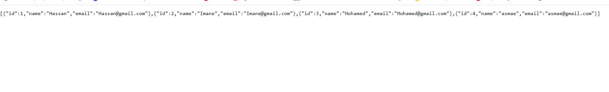
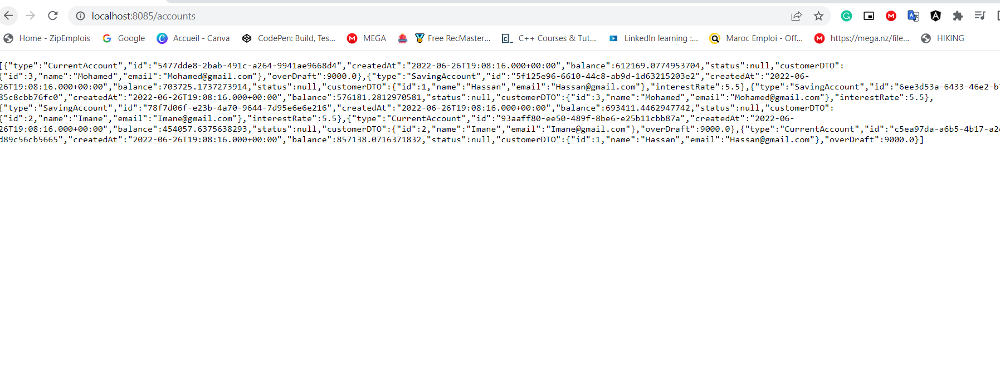

<h2 align="center"  style="color: red" >Compte Rendu de La partie Backend de l'application</h4>
<h3>Développé une Application de gestion des Comptes des Customers en Utilisant une Architecture
Spring MVC Rendu HTml Coté Client Avec le Framework Angular</h3>
<h4>Dans ce Compte Rendu Je vais vous présentez l'ensemble des étapes en utilisant l'architecture Coté Client</h4>
<ul>
<li style="color: Green"><strong>Tableau des Customers</strong>
  

    <h5 style="color: grey">Ici on tapant l'URL hhtp://localhost:8085/customers , on visualise l'ensemble des
Customers</h5>
        <ol> </ol>
        <ol style="text-align: center"><strong style="color: red">Figure 1: </strong> Affichage de liste des Customers</ol>
 
<li style="color: Green"><strong>Consultation de l'ensemble des Opérations de chaque Customer</strong>
  

    <h5 style="color: grey">Ici on tapant l'URL hhtp://localhost:8085/accounts , on visualise l'ensemble des
des détails des comptes de chaque customer</h5>
        <ol> </ol>
        <ol style="text-align: center"><strong style="color: red">Figure 2: </strong> Affichage des détails des comptes des customers</ol>
<h5 style="color: grey">L'ensemble de ces Ids vont etre utilisé pour Consulter le comptes dans la partie Front
</h5>
</ul>